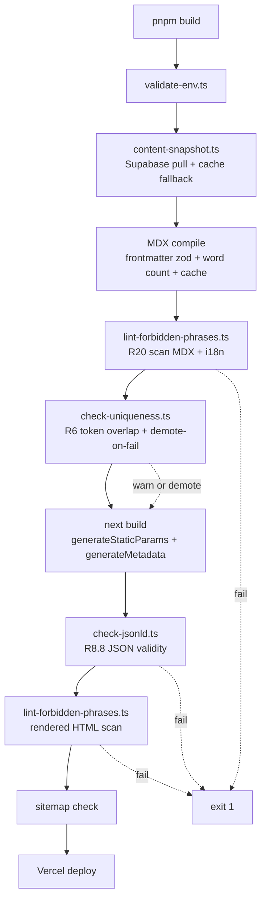

# Design Document

## 1. Overview

This design realizes the 24 requirements in `requirements.md` as a Next.js 14+ App Router application deployed on Vercel, with Supabase Postgres serving dual duty as the Lead_Store and the Structured_Content_Store, and with repository-managed MDX files serving as the Narrative_Content_Store. The Content_Layer is the single abstraction that page components depend on, so swapping either data source later (for example, moving narrative into a headless CMS) is a one-module change per R17.12.

Conversion is WhatsApp-first: the Booking_Form produces a prefilled `wa.me` message after persisting a lead row in Supabase. Programmatic SEO is built around a three-state coverage model (`launched`, `coverable`, `inactive`) that lets the site scale to hundreds of cities without serving thin pages or 404ing future customers.

```mermaid
flowchart LR
  V[Visitor] --> CDN[Vercel Edge / CDN]
  CDN --> N[Next.js App Router]
  N -->|SSG + ISR| S[Supabase Postgres]
  N -->|MDX bundle| MDX[(content/ MDX)]
  N -->|/api/booking| RH[Booking Route Handler]
  RH -->|service-role insert| S
  RH -.->|webhook| W[Admin Notify Webhook]
  V -->|click WhatsApp| WA[wa.me / WhatsApp app]
  N -->|/api/og| OG[next/og]
  SStudio[Supabase Studio admin] --> S
  S -->|pg_net trigger| RV[/api/revalidate]
  RV --> N
```

## 2. Folder Structure

```
app/
  [locale]/
    layout.tsx                  # sets <html lang>, fonts, consent banner
    page.tsx                    # homepage (R9.1)
    sewa-mobil/                 # id: city routes
      [city]/
        page.tsx                # CityTemplate OR CoverageTemplate (R3.6, R22)
        airport-transfer/
          page.tsx              # AirportTransferTemplate (R9.5)
        [vehicle]/
          page.tsx              # CityVehicleTemplate (R5.9)
    car-rental/                 # en mirror via slug map (R3.3)
      [city]/
        page.tsx                # re-export shared template
        airport-transfer/page.tsx
        [vehicle]/page.tsx
    internasional/[country]/page.tsx   # id
    international/[country]/page.tsx   # en
    armada/                     # id fleet
      page.tsx
      [vehicle]/page.tsx
    fleet/                      # en fleet
      page.tsx
      [vehicle]/page.tsx
    layanan/[service]/page.tsx
    services/[service]/page.tsx
    blog/
      page.tsx
      [article]/page.tsx
    booking/page.tsx
    kontak/page.tsx
    contact/page.tsx
    faq/page.tsx
    syarat-ketentuan/page.tsx
    terms/page.tsx
    kebijakan-privasi/page.tsx
    privacy/page.tsx
    not-found.tsx
  api/
    booking/route.ts            # POST: persist lead + webhook
    revalidate/route.ts         # POST: secret-gated on-demand ISR
    og/route.tsx                # GET: dynamic OG image (next/og)
  sitemap.ts                    # R7.4
  robots.ts                     # R7.6
  layout.tsx                    # root, sets HSTS + CSP headers via middleware
  global-error.tsx
components/
  templates/
    HomeTemplate.tsx
    CityTemplate.tsx
    CoverageTemplate.tsx
    CountryTemplate.tsx
    VehicleTemplate.tsx
    CityVehicleTemplate.tsx
    AirportTransferTemplate.tsx
    ServiceTemplate.tsx
    BlogArticleTemplate.tsx
    BookingTemplate.tsx
    ContactTemplate.tsx
    StaticTemplate.tsx
  booking/
    BookingForm.tsx             # client
    BookingConfirmation.tsx
  chat/
    WhatsAppButton.tsx          # client (floating)
    InlineWhatsAppCta.tsx
  nav/
    PrimaryNav.tsx
    Footer.tsx
    LocaleSwitcher.tsx          # client
  seo/
    JsonLd.tsx
    Breadcrumb.tsx
  ui/                           # shadcn/ui re-exports + variants
  mdx/
    Callout.tsx
    Faq.tsx
    Landmark.tsx
    TripIdea.tsx
    Tip.tsx
    Testimonial.tsx
    InternalLink.tsx
    VehicleCard.tsx
    index.ts                    # MDX components registry (allowlist)
  motion/
    MotionWrapper.tsx           # client; honors prefers-reduced-motion
  consent/
    CookieConsentBanner.tsx     # client
lib/
  content/
    index.ts                    # public loader contract (R17.4)
    structured/                 # Supabase-backed
      snapshot.ts               # reads .next/cache/content-snapshot.json
      cities.ts
      countries.ts
      vehicles.ts
      services.ts
      airports.ts
      aliases.ts
      relations.ts
    narrative/
      mdx.ts                    # compiles + caches MDX
      schema.ts                 # zod frontmatter schemas
      cities.ts
      countries.ts
      vehicles.ts
      services.ts
      articles.ts
  seo/
    metadata.ts                 # buildMetadata (R7.1)
    jsonld.ts                   # builders (R8)
    canonical.ts                # absolute URL helpers
  i18n/
    dictionaries/
      id.json
      en.json
    getDictionary.ts
    slugMap.ts                  # central ID<->EN segment map
    pageEquivalent.ts           # for locale switcher (R4.6/R4.7)
  booking/
    schema.ts                   # shared zod schema (R10)
    normalizePhone.ts
  whatsapp/
    handler.ts                  # buildWhatsAppUrl (R11)
    labels.ts
  supabase/
    server.ts                   # factory: anon vs service_role (R21.7)
    client.ts                   # browser (anon only, read-only allowlist)
    types.ts                    # re-exports generated database types
  security/
    originCheck.ts
    hashIp.ts                   # SHA-256 + salt
    rateLimit.ts                # token bucket via Supabase `rate_limit`
    spamBlocklist.ts
    envCheck.ts                 # build-time required env var validator
  analytics/
    client.ts                   # wraps plausible/ga; consent-gated
content/
  cities/
    id/bogor.mdx
    id/jakarta.mdx
    en/bogor.mdx
    en/jakarta.mdx
  countries/{id,en}/*.mdx
  vehicles/{id,en}/*.mdx
  services/{id,en}/*.mdx
  articles/{id,en}/*.mdx
supabase/
  migrations/
    0001_init_leads.sql
    0002_init_structured_content.sql
    0003_rls_policies.sql
    0004_triggers_revalidate.sql
    0005_rate_limit.sql
  seed.sql
  config.toml
scripts/
  content-snapshot.ts           # pre-build Supabase pull (R5.13)
  lint-forbidden-phrases.ts     # R20
  check-uniqueness.ts           # R6
  check-jsonld.ts               # R8.8
  validate-env.ts               # R17.10
  gen-db-types.ts               # invokes `supabase gen types`
tests/
  unit/
  component/
  e2e/
types/
  database.ts                   # generated from Supabase
docs/
  ops/
    content-editing.md          # R24.6
    admin-runbook.md
    incident-playbook.md
```

## 3. Data Layer

### 3.1 Supabase schema (DDL)

Full DDL for leads and the core content tables is shown below. `0001_init_leads.sql` + `0002_init_structured_content.sql` give the complete schema; policies live in `0003_rls_policies.sql`.

```sql
-- 0001_init_leads.sql
create extension if not exists "pgcrypto";
create extension if not exists "pg_net";

create table public.leads (
  id               uuid primary key default gen_random_uuid(),
  created_at       timestamptz not null default now(),
  full_name        text not null,
  whatsapp_number  text not null,
  pickup_city      text not null,
  pickup_location  text not null,
  destination      text,
  pickup_date      date not null,
  pickup_time      time not null,
  rental_duration  text not null,
  passengers       integer not null check (passengers between 1 and 30),
  preferred_vehicle text,
  trip_type        text not null,
  notes            text,
  locale           text not null check (locale in ('id','en')),
  source_page      text,
  utm_source       text,
  utm_medium       text,
  utm_campaign     text,
  status           text not null default 'new'
                   check (status in ('new','contacted','confirmed','completed','cancelled','spam')),
  ip_hash          text,
  user_agent       text,
  -- forward compatibility: link a lead to a future Supabase Auth user account.
  -- nullable in MVP (no auth yet, R2.5). Populated post-MVP when a visitor
  -- registers and their whatsapp_number / email is matched to historical leads.
  user_id          uuid references auth.users(id) on delete set null
);
create index leads_created_at_desc_idx on public.leads (created_at desc);
create index leads_pickup_city_idx     on public.leads (pickup_city);
create index leads_trip_type_idx       on public.leads (trip_type);
create index leads_status_idx          on public.leads (status);
create index leads_user_id_idx         on public.leads (user_id) where user_id is not null;

create table public.rate_limit (
  ip_hash       text not null,
  window_start  timestamptz not null,
  count         integer not null default 1,
  primary key (ip_hash, window_start)
);
create index rate_limit_window_idx on public.rate_limit (window_start);
```

```sql
-- 0002_init_structured_content.sql
create table public.cities (
  id                uuid primary key default gen_random_uuid(),
  slug              text not null unique
                    check (slug ~ '^[a-z0-9]+(-[a-z0-9]+)*$' and length(slug) between 1 and 80),
  parent_region     text,
  country_code      text not null default 'ID',
  latitude          double precision,
  longitude         double precision,
  coverage_state    text not null default 'coverable'
                    check (coverage_state in ('launched','coverable','inactive')),
  allow_index       boolean not null default false,
  featured_order    integer,
  launch_priority   integer not null default 0,
  pricing_hint_from integer,
  pricing_hint_to   integer,
  chauffeur_only    boolean not null default true check (chauffeur_only = true),
  created_at        timestamptz not null default now(),
  updated_at        timestamptz not null default now()
);
create index cities_coverage_idx       on public.cities (coverage_state);
create index cities_coverage_prio_idx  on public.cities (coverage_state, launch_priority desc);
create index cities_featured_idx       on public.cities (featured_order) where featured_order is not null;

create table public.city_translations (
  city_id        uuid not null references public.cities(id) on delete cascade,
  locale         text not null check (locale in ('id','en')),
  display_name   text not null check (char_length(display_name) between 1 and 120),
  short_blurb    text,
  primary key (city_id, locale)
);

create table public.countries (
  id            uuid primary key default gen_random_uuid(),
  slug          text not null unique,
  country_code  text not null unique,
  chauffeur_only boolean not null default true check (chauffeur_only = true),
  active        boolean not null default true,
  created_at    timestamptz not null default now(),
  updated_at    timestamptz not null default now()
);
create table public.country_translations (
  country_id   uuid not null references public.countries(id) on delete cascade,
  locale       text not null check (locale in ('id','en')),
  display_name text not null,
  primary key (country_id, locale)
);

create table public.vehicles (
  id            uuid primary key default gen_random_uuid(),
  slug          text not null unique,
  seats         integer not null check (seats between 1 and 30),
  luggage       integer not null check (luggage >= 0),
  active        boolean not null default true,
  chauffeur_only boolean not null default true check (chauffeur_only = true),
  created_at    timestamptz not null default now(),
  updated_at    timestamptz not null default now()
);
create table public.vehicle_translations (
  vehicle_id   uuid not null references public.vehicles(id) on delete cascade,
  locale       text not null check (locale in ('id','en')),
  display_name text not null,
  primary key (vehicle_id, locale)
);

create table public.services (
  id            uuid primary key default gen_random_uuid(),
  slug          text not null unique,
  active        boolean not null default true,
  chauffeur_only boolean not null default true check (chauffeur_only = true),
  created_at    timestamptz not null default now(),
  updated_at    timestamptz not null default now()
);
create table public.service_translations (
  service_id   uuid not null references public.services(id) on delete cascade,
  locale       text not null check (locale in ('id','en')),
  display_name text not null,
  primary key (service_id, locale)
);

create table public.airports (
  id         uuid primary key default gen_random_uuid(),
  code       text not null unique,      -- IATA, e.g. CGK
  city_id    uuid not null references public.cities(id) on delete cascade,
  name       text not null,
  created_at timestamptz not null default now(),
  updated_at timestamptz not null default now()
);

create table public.city_vehicles (
  city_id    uuid not null references public.cities(id) on delete cascade,
  vehicle_id uuid not null references public.vehicles(id) on delete cascade,
  primary key (city_id, vehicle_id)
);

create table public.city_airports (
  city_id    uuid not null references public.cities(id) on delete cascade,
  airport_id uuid not null references public.airports(id) on delete cascade,
  primary key (city_id, airport_id)
);

create table public.city_related (
  city_id          uuid not null references public.cities(id) on delete cascade,
  related_city_id  uuid not null references public.cities(id) on delete cascade,
  rank             integer not null default 0,
  primary key (city_id, related_city_id),
  check (city_id <> related_city_id)
);

create table public.city_aliases (
  alias_slug      text primary key
                  check (alias_slug ~ '^[a-z0-9]+(-[a-z0-9]+)*$'),
  canonical_city_id uuid not null references public.cities(id) on delete cascade,
  created_at      timestamptz not null default now()
);

-- updated_at trigger
create or replace function public.touch_updated_at() returns trigger language plpgsql as $$
begin new.updated_at = now(); return new; end $$;

do $$ declare t text; begin
  for t in select unnest(array['cities','countries','vehicles','services','airports']) loop
    execute format('create trigger %I_touch before update on public.%I
                    for each row execute function public.touch_updated_at();', t||'_touch', t);
  end loop;
end $$;
```

### 3.2 RLS policy matrix

| Table                                            | anon SELECT                                             | anon write | service_role | admin role |
| ------------------------------------------------ | ------------------------------------------------------- | ---------- | ------------ | ---------- |
| `leads`                                          | none                                                    | none       | full         | full       |
| `rate_limit`                                     | none                                                    | none       | full         | full       |
| `cities`                                         | rows where `coverage_state in ('launched','coverable')` | none       | full         | full       |
| `city_translations`                              | rows whose city passes the above                        | none       | full         | full       |
| `countries`, `country_translations`              | `active = true`                                         | none       | full         | full       |
| `vehicles`, `vehicle_translations`               | `active = true`                                         | none       | full         | full       |
| `services`, `service_translations`               | `active = true`                                         | none       | full         | full       |
| `airports`                                       | all                                                     | none       | full         | full       |
| `city_vehicles`, `city_airports`, `city_related` | rows whose parent passes their table rule               | none       | full         | full       |
| `city_aliases`                                   | all (needed for 301 lookup at request time)             | none       | full         | full       |

```sql
-- 0003_rls_policies.sql (excerpt)
alter table public.leads enable row level security;
create policy leads_anon_deny on public.leads for all to anon using (false) with check (false);
create policy leads_service_rw on public.leads for all to service_role using (true) with check (true);

alter table public.cities enable row level security;
create policy cities_anon_read on public.cities
  for select to anon using (coverage_state in ('launched','coverable'));
create policy cities_service_rw on public.cities for all to service_role using (true) with check (true);
create policy cities_admin_write on public.cities for all to authenticated
  using ((auth.jwt() ->> 'role') = 'admin') with check ((auth.jwt() ->> 'role') = 'admin');
-- same pattern for the other content tables
```

### 3.3 Generated types

`scripts/gen-db-types.ts` shells out to `supabase gen types typescript --project-id $PROJECT > types/database.ts`. All Supabase loader code imports from `types/database.ts`.

## 4. MDX Narrative Layer

### 4.1 File layout (R23.1)

`content/{cities|countries|vehicles|services|articles}/{id|en}/{slug}.mdx`. Missing locales are tolerated per R23.7 (auto-demote City to coverable for that locale; exclude Country/Vehicle/Service with a warning).

### 4.2 Frontmatter schema (zod)

```ts
// lib/content/narrative/schema.ts
import { z } from "zod";

export const baseFm = z.object({
  slug: z
    .string()
    .regex(/^[a-z0-9]+(-[a-z0-9]+)*$/)
    .max(80),
  locale: z.enum(["id", "en"]),
  seoTitle: z.string().min(30).max(65),
  seoDescription: z.string().min(70).max(160),
  heroHeadline: z.string().min(4).max(90),
  heroSubheadline: z.string().min(10).max(180),
  chauffeurOnly: z.literal(true),
  updatedAt: z.string().datetime(),
});

export const cityFm = baseFm.extend({
  landmarks: z
    .array(z.object({ name: z.string(), note: z.string().optional() }))
    .min(3)
    .max(20),
  tourismHighlights: z.array(z.string()).max(10).optional(),
  itineraryIdeas: z
    .array(z.object({ title: z.string(), body: z.string() }))
    .max(5)
    .optional(),
  localTips: z.array(z.string()).max(10).optional(),
  popularDestinations: z.array(z.string()).min(3).max(50),
  faqs: z
    .array(z.object({ q: z.string(), a: z.string() }))
    .min(3)
    .max(20),
  testimonial: z.object({ quote: z.string(), author: z.string() }).optional(),
});
// countryFm, vehicleFm, serviceFm, articleFm follow similar pattern
```

### 4.3 Compilation choice

Pick `@next/mdx` (Vercel-maintained, pinned to the Next.js major) for compile-time MDX, combined with `gray-matter` for frontmatter parsing and a small custom cache layer. The previously popular `next-mdx-remote` (HashiCorp fork) is archived as of 2026, so we avoid inheriting a read-only dependency. `@next/mdx` compiles MDX as first-class modules and plays cleanly with Server Components; the frontmatter cache and word-count extraction are ~60 lines of code in `lib/content/narrative/mdx.ts`.

### 4.4 Allowlisted MDX components

```ts
// components/mdx/index.ts
import { Callout } from "./Callout";
import { Faq } from "./Faq";
import { Landmark } from "./Landmark";
import { TripIdea } from "./TripIdea";
import { Tip } from "./Tip";
import { Testimonial } from "./Testimonial";
import { InternalLink } from "./InternalLink";
import { VehicleCard } from "./VehicleCard";

export const mdxAllowlist = {
  Callout,
  FAQ: Faq,
  Landmark,
  TripIdea,
  Tip,
  Testimonial,
  InternalLink,
  VehicleCard,
};
export type AllowedMdxComponent = keyof typeof mdxAllowlist;
```

The MDX compiler strips out any JSX tag not present in `mdxAllowlist` before rendering and the build fails per R23.3 if such a tag is referenced.

### 4.5 Cache

Compiled MDX output is keyed by SHA-256 of (file contents + frontmatter schema version) and written to `.next/cache/mdx/{locale}/{entity}/{slug}.json`. The loader first consults the cache; a miss triggers compile + write. This keeps incremental builds fast at hundreds of city files (R23.9).

## 5. Content_Layer

### 5.1 Types

```ts
// lib/content/index.ts (types excerpt)
export interface City {
  id: string;
  slug: string;
  parentRegion: string | null;
  countryCode: string;
  lat: number | null;
  lng: number | null;
  coverageState: "launched" | "coverable" | "inactive";
  allowIndex: boolean;
  featuredOrder: number | null;
  launchPriority: number;
  pricingHint: { fromIdr: number; toIdr: number } | null;
}
export interface CityTranslation {
  locale: Locale;
  displayName: string;
  shortBlurb?: string | null;
}
export interface CityNarrative {
  intro: string;
  landmarks: { name: string; note?: string }[];
  tourismHighlights?: string[];
  itineraryIdeas?: { title: string; body: string }[];
  localTips?: string[];
  popularDestinations: string[];
  faqs: { q: string; a: string }[];
  testimonial?: { quote: string; author: string };
  heroHeadline: string;
  heroSubheadline: string;
  seoTitle: string;
  seoDescription: string;
  wordCount: { intro: number; body: number };
}
export interface CityWithNarrative extends City {
  locale: Locale;
  displayName: string;
  shortBlurb?: string | null;
  narrative: CityNarrative | null; // null for coverable without MDX
  availableVehicles: VehicleSummary[];
  airports: AirportSummary[];
  relatedCities: CitySummary[];
}
export type Locale = "id" | "en";
```

### 5.2 Loader signatures (R17.4)

```ts
export function getCities(
  locale: Locale,
  filter?: { coverage?: City["coverageState"][] },
): Promise<CityWithNarrative[]>;
export function getCity(slug: string, locale: Locale): Promise<CityWithNarrative | null>;
export function getCoverageCity(slug: string, locale: Locale): Promise<CityWithNarrative | null>;
export function getCountries(locale: Locale): Promise<CountryWithNarrative[]>;
export function getCountry(slug: string, locale: Locale): Promise<CountryWithNarrative | null>;
export function getVehicles(locale: Locale): Promise<VehicleWithNarrative[]>;
export function getVehicle(slug: string, locale: Locale): Promise<VehicleWithNarrative | null>;
export function getServices(locale: Locale): Promise<ServiceWithNarrative[]>;
export function getService(slug: string, locale: Locale): Promise<ServiceWithNarrative | null>;
export function getAirports(): Promise<Airport[]>;
export function getCityAirports(citySlug: string): Promise<Airport[]>;
export function getCityVehicles(citySlug: string, locale: Locale): Promise<VehicleSummary[]>;
export function getRelatedCities(citySlug: string, locale: Locale): Promise<CitySummary[]>;
export function getCityAlias(slug: string): Promise<{ canonicalSlug: string } | null>;
export function getArticles(locale: Locale): Promise<ArticleSummary[]>;
export function getArticle(slug: string, locale: Locale): Promise<ArticleWithNarrative | null>;
```

Single-entry loaders return `null` on miss per R17.4. `getCities` accepts a filter because ops queries like "all coverable sorted by launch_priority" are common; default returns `launched` + `coverable` for active Locale.

### 5.3 Snapshot strategy (R5.13)

```ts
// scripts/content-snapshot.ts (outline)
import { createClient } from "@supabase/supabase-js";
import { writeFileSync, existsSync, readFileSync } from "node:fs";

const snapshotPath = ".next/cache/content-snapshot.json";
async function main() {
  try {
    const sb = createClient(
      process.env.NEXT_PUBLIC_SUPABASE_URL!,
      process.env.SUPABASE_SERVICE_ROLE_KEY!,
    );
    const [
      cities,
      cityT,
      countries,
      countryT,
      vehicles,
      vehicleT,
      services,
      serviceT,
      airports,
      cityVehicles,
      cityAirports,
      cityRelated,
      cityAliases,
    ] = await Promise.all([
      sb.from("cities").select("*"),
      sb.from("city_translations").select("*"),
      // ...remaining tables
    ]);
    const snap = {
      cities: cities.data,
      cityTranslations: cityT.data,
      /* ... */ generatedAt: new Date().toISOString(),
    };
    writeFileSync(snapshotPath, JSON.stringify(snap));
    console.log(`[snapshot] wrote ${snapshotPath}`);
  } catch (e) {
    if (existsSync(snapshotPath)) {
      console.warn(`[snapshot] Supabase read failed, falling back to cached snapshot:`, e);
    } else {
      throw new Error(`[snapshot] Supabase read failed and no cache present: ${e}`);
    }
  }
}
main();
```

`package.json` has `"build": "node scripts/content-snapshot.ts && next build"`. The structured loaders read from this JSON at build time; at request time, ISR regenerates pages against the snapshot already bundled into the build unless on-demand revalidation fires a fresh read.

## 6. Build Pipeline



| Stage                     | Blocks on failure?                                   | Requirement |
| ------------------------- | ---------------------------------------------------- | ----------- |
| env validation            | yes                                                  | R17.10      |
| snapshot pull             | no (cache fallback)                                  | R5.13       |
| MDX compile               | yes (required MDX fails) or demote (R23.7)           | R23.4       |
| forbidden-phrase (source) | yes                                                  | R20.2       |
| uniqueness                | demote `launched` cities to `coverable`; warn others | R6.6        |
| JSON-LD validity          | yes                                                  | R8.8        |
| forbidden-phrase (HTML)   | yes                                                  | R20.1–R20.2 |

## 7. ISR and On-Demand Revalidation

Every programmatic page file declares:

```ts
export const revalidate = 3600; // R5.10 (between 3600 and 86400)
export const dynamicParams = true; // allow new slugs to render first visit
```

### 7.1 Revalidate endpoint contract

```
POST /api/revalidate
Headers: x-revalidate-secret: <REVALIDATE_SECRET>
Body: { entityType: "city"|"country"|"vehicle"|"service"|"airport"|"article",
        slug: string,
        locales?: ("id"|"en")[]  // defaults to both
}
```

Server calls `revalidatePath` for every URL the entity participates in. For a city slug `bogor` it fans out: `/sewa-mobil/bogor`, `/en/car-rental/bogor`, `/sewa-mobil/bogor/airport-transfer` (if airport exists), `/sewa-mobil/bogor/{vehicleSlug}` for each linked vehicle, `/` (featured cities grid), `/sitemap.xml`.

```mermaid
sequenceDiagram
  Supabase->>pg_net: row update on cities
  pg_net->>/api/revalidate: POST with x-revalidate-secret
  Note over /api/revalidate: verify secret<br/>fail -> 401
  /api/revalidate->>Next.js: revalidatePath(/sewa-mobil/bogor)
  /api/revalidate->>Next.js: revalidatePath(/en/car-rental/bogor)
  /api/revalidate->>Next.js: revalidatePath(/sewa-mobil/bogor/airport-transfer)
  /api/revalidate->>Next.js: revalidatePath(/sewa-mobil/bogor/innova)
  /api/revalidate->>Next.js: revalidatePath(/sitemap.xml)
  /api/revalidate-->>pg_net: 200 { revalidated: [...] }
```

### 7.2 Supabase trigger

```sql
-- 0004_triggers_revalidate.sql (excerpt)
create or replace function public.notify_revalidate() returns trigger language plpgsql as $$
declare payload jsonb;
begin
  payload := jsonb_build_object('entityType', TG_ARGV[0], 'slug', new.slug);
  perform net.http_post(
    url := current_setting('app.revalidate_url'),
    headers := jsonb_build_object('x-revalidate-secret', current_setting('app.revalidate_secret'),
                                  'content-type', 'application/json'),
    body := payload,
    timeout_milliseconds := 5000
  );
  return new;
end $$;

create trigger cities_revalidate after insert or update or delete on public.cities
for each row execute function public.notify_revalidate('city');
-- similar triggers for countries/vehicles/services/airports
```

Retry/backoff per R24.3 is handled by a companion function reading a `revalidate_outbox` table enqueued on pg_net failure, polled by a Supabase scheduled cron every minute.

## 8. Routing Rules (R3.6, R22)

```ts
// app/[locale]/sewa-mobil/[city]/page.tsx
import { notFound, redirect } from "next/navigation";
import { getCity, getCityAlias } from "@/lib/content";
import { resolveLocale, citySlugTarget } from "@/lib/i18n/slugMap";
import { CityTemplate } from "@/components/templates/CityTemplate";
import { CoverageTemplate } from "@/components/templates/CoverageTemplate";

export const revalidate = 3600;
export const dynamicParams = true;

export async function generateStaticParams() {
  const cities = await getCities("id", { coverage: ["launched","coverable"] });
  return cities.map(c => ({ locale: "id", city: c.slug }));
}

export default async function Page({ params }: { params: { locale: string; city: string } }) {
  const locale = resolveLocale(params.locale);            // "id" | "en" | null
  if (!locale) notFound();

  const alias = await getCityAlias(params.city);
  if (alias) redirect(citySlugTarget(alias.canonicalSlug, locale));   // 307 by default; set statusCode 301 via middleware if needed

  const city = await getCity(params.city, locale);
  if (!city || city.coverageState === "inactive") notFound();

  if (city.coverageState === "coverable") {
    return <CoverageTemplate city={city} locale={locale} />;
  }
  return <CityTemplate city={city} locale={locale} />;
}
```

English mirror at `app/[locale]/car-rental/[city]/page.tsx` re-exports the same Page with `generateStaticParams` seeded from `locale === "en"`.

## 9. Templates and Section Order

All templates read R9 criterion numbers. Each template exports a `sections` array used by the renderer and consumed by tests that assert the exact order per R9 criterion 1–8.

| Template                  | Section order (matches R9)                                                                                                                                          |
| ------------------------- | ------------------------------------------------------------------------------------------------------------------------------------------------------------------- |
| `HomeTemplate`            | hero → trustSignals → featuredServices → featuredVehicles → featuredCities → howItWorks → corporateCta → airportCta → testimonials → faqHighlights → ctaBand (R9.1) |
| `CityTemplate`            | breadcrumb → hero+cta → chauffeurOnlyVp → vehiclesGrid → popularDestinations → pricingHint → airportCta → faqs → relatedCities → ctaBand (R9.2)                     |
| `CountryTemplate`         | breadcrumb → hero+cta → chauffeurOnlyVp → supportedCities → useCases → vehicles → faqs → ctaBand (R9.3)                                                             |
| `VehicleTemplate`         | breadcrumb → hero → specBlock → recommendedTripTypes → priceRangeHint → serviceCities → relatedVehicles → faqs → ctaBand (R9.4)                                     |
| `AirportTransferTemplate` | breadcrumb → hero → howItWorks → pricingHint → recommendedVehicles → serviceCities → faqs → ctaBand (R9.5)                                                          |
| `BlogArticleTemplate`     | breadcrumb → articleHeader → coverImage → body → authorBlock → relatedArticles → chauffeurCtaBand → finalCtaBand (R9.6)                                             |
| `BookingTemplate`         | hero → BookingForm → altWhatsAppCta → antiFraudNotice → bookingFaqs (R9.7)                                                                                          |
| `ContactTemplate`         | hero → waNumber → operatingHours → officeAddress → map → email → social → antiFraudNotice (R9.8)                                                                    |
| `CoverageTemplate`        | breadcrumb → hero+waCta → chauffeurGenericParagraph (city-name templated) → prefilledBookingForm → nearbyLaunchedCities → antiFraudNotice → ctaBand (R22.4)         |

### 9.1 Coverage page wireframe

```
┌──────────────────────────────────────────────────────────┐
│ Breadcrumb: Home > Sewa Mobil > Purwakarta               │
├──────────────────────────────────────────────────────────┤
│ H1: Sewa Mobil dengan Supir di Purwakarta                │
│ Sub: Layanan tersedia. Hubungi admin via WhatsApp.       │
│ [Primary CTA: WhatsApp Admin]   [Booking Form]           │
├──────────────────────────────────────────────────────────┤
│ Paragraph: "Arasya Rentcar melayani sewa mobil dengan    │
│ supir di Purwakarta dan sekitarnya..."                   │
├──────────────────────────────────────────────────────────┤
│ BookingForm (pickup_city prefilled: Purwakarta)          │
├──────────────────────────────────────────────────────────┤
│ Kota terdekat yang sudah tersedia konten lengkap:        │
│ [Bandung] [Bogor] [Jakarta]                              │
├──────────────────────────────────────────────────────────┤
│ Anti-fraud notice (official admin number)                │
├──────────────────────────────────────────────────────────┤
│ Final CTA band                                           │
└──────────────────────────────────────────────────────────┘
```

## 10. Metadata Generator

```ts
// lib/seo/metadata.ts
import type { Metadata } from "next";
import { absUrl } from "./canonical";
import { pageEquivalent } from "@/lib/i18n/pageEquivalent";

type PageType =
  | "homepage"
  | "city"
  | "country"
  | "vehicle"
  | "airport"
  | "service"
  | "article"
  | "static";

export interface MetadataInput {
  title: string;
  description: string;
  locale: "id" | "en";
  path: string;
  pageType: PageType;
  subject?: string;
  allowIndex?: boolean; // false for noindex coverage pages
  availableLocales: ("id" | "en")[]; // list of locales this page exists in
}

export function buildMetadata(i: MetadataInput): Metadata {
  const canonical = absUrl(i.path, i.locale);
  const languages: Record<string, string> = {};
  for (const l of i.availableLocales)
    languages[l === "id" ? "id-ID" : "en"] = absUrl(pageEquivalent(i.path, i.locale, l), l);
  languages["x-default"] = canonical;

  const robots =
    i.allowIndex === false ? { index: false, follow: true } : { index: true, follow: true };
  const og = new URL("/api/og", process.env.NEXT_PUBLIC_SITE_URL!);
  og.searchParams.set("title", i.title);
  if (i.subject) og.searchParams.set("subtitle", i.subject);
  og.searchParams.set("locale", i.locale);
  og.searchParams.set("pageType", i.pageType);

  return {
    title: i.title,
    description: i.description,
    alternates: { canonical, languages },
    openGraph: {
      url: canonical,
      title: i.title,
      description: i.description,
      images: [{ url: og.toString(), width: 1200, height: 630 }],
      locale: i.locale,
    },
    twitter: {
      card: "summary_large_image",
      title: i.title,
      description: i.description,
      images: [og.toString()],
    },
    robots,
  };
}
```

## 11. JSON-LD Generator

```ts
// lib/seo/jsonld.ts
const CTX = "https://schema.org";
export interface LocalBusinessCtx {
  name: string;
  url: string;
  image: string;
  telephone: string;
  address: {
    streetAddress: string;
    addressLocality: string;
    addressRegion: string;
    postalCode: string;
    addressCountry: string;
  };
  areaServed: string[];
  priceRange: string;
  openingHoursSpecification: OHS[];
  sameAs: string[];
}

export const localBusinessJsonLd = (c: LocalBusinessCtx) => ({
  "@context": CTX,
  "@type": "LocalBusiness",
  ...c,
});

export const serviceJsonLd = (c: {
  url: string;
  name: string;
  description: string;
  provider: LocalBusinessCtx;
}) => ({
  "@context": CTX,
  "@type": "Service",
  serviceType: "Chauffeur car rental",
  url: c.url,
  name: c.name,
  description: c.description,
  provider: localBusinessJsonLd(c.provider),
});

export const faqPageJsonLd = (items: { q: string; a: string }[]) =>
  items.length >= 2
    ? {
        "@context": CTX,
        "@type": "FAQPage",
        mainEntity: items.map((i) => ({
          "@type": "Question",
          name: i.q,
          acceptedAnswer: { "@type": "Answer", text: i.a },
        })),
      }
    : null;

export const breadcrumbListJsonLd = (trail: { name: string; url: string }[]) => ({
  "@context": CTX,
  "@type": "BreadcrumbList",
  itemListElement: trail.map((t, i) => ({
    "@type": "ListItem",
    position: i + 1,
    name: t.name,
    item: t.url,
  })),
});

export const articleJsonLd = (a: {
  headline: string;
  datePublished: string;
  dateModified: string;
  author: string;
  image: string;
  url: string;
}) => ({
  "@context": CTX,
  "@type": "Article",
  ...a,
  author: { "@type": "Person", name: a.author },
});
```

`<JsonLd>` component emits one `<script type="application/ld+json">` per block (R8.7). `scripts/check-jsonld.ts` parses every emitted block during post-build; non-JSON fails the build (R8.8).

## 12. Sitemap and Robots

```ts
// app/sitemap.ts
import { MetadataRoute } from "next";
import {
  getCities,
  getCountries,
  getVehicles,
  getServices,
  getArticles,
  getAirports,
  getCityAirports,
} from "@/lib/content";
import { absUrl } from "@/lib/seo/canonical";
import { pageEquivalent } from "@/lib/i18n/pageEquivalent";

const STATIC = [
  "/",
  "/armada",
  "/booking",
  "/kontak",
  "/blog",
  "/faq",
  "/syarat-ketentuan",
  "/kebijakan-privasi",
];

export default async function sitemap(): Promise<MetadataRoute.Sitemap> {
  const cities = await getCities("id", { coverage: ["launched"] });
  const coverage = await getCities("id", { coverage: ["coverable"] });
  const entries: MetadataRoute.Sitemap = [];

  for (const path of STATIC) entries.push(altEntry(path, "id", ["id", "en"]));
  for (const c of cities) {
    entries.push(altEntry(`/sewa-mobil/${c.slug}`, "id", ["id", "en"]));
    for (const v of c.availableVehicles)
      entries.push(altEntry(`/sewa-mobil/${c.slug}/${v.slug}`, "id", ["id", "en"]));
    if (c.airports.length)
      entries.push(altEntry(`/sewa-mobil/${c.slug}/airport-transfer`, "id", ["id", "en"]));
  }
  for (const c of coverage)
    if (c.allowIndex) entries.push(altEntry(`/sewa-mobil/${c.slug}`, "id", ["id", "en"]));
  // countries, vehicles, services, articles similar
  return entries;
}

function altEntry(
  path: string,
  baseLocale: "id" | "en",
  locales: ("id" | "en")[],
): MetadataRoute.Sitemap[number] {
  const alternates: Record<string, string> = {};
  for (const l of locales)
    alternates[l === "id" ? "id-ID" : "en"] = absUrl(pageEquivalent(path, baseLocale, l), l);
  alternates["x-default"] = absUrl(path, baseLocale);
  return {
    url: absUrl(path, baseLocale),
    lastModified: new Date(),
    changeFrequency: "weekly",
    priority: 0.7,
    alternates: { languages: alternates },
  };
}
```

If the URL count crosses 40k (R7.5), split into `app/sitemap/[type]/route.ts` files and have `app/sitemap.xml/route.ts` emit a sitemap index referencing them. Simple rule: one sub-sitemap per entity type, paged by 40k.

```ts
// app/robots.ts
import { absUrl } from "@/lib/seo/canonical";
export default function robots() {
  return { rules: [{ userAgent: "*", allow: "/" }], sitemap: absUrl("/sitemap.xml", "id") };
}
```

## 13. Open Graph Endpoint

```ts
// app/api/og/route.tsx
import { ImageResponse } from "next/og";
export const runtime = "edge";
const DIM = { width: 1200, height: 630 };

export async function GET(req: Request) {
  const url = new URL(req.url);
  const title = url.searchParams.get("title")?.slice(0, 90) ?? "Arasya Rentcar";
  const subtitle = url.searchParams.get("subtitle")?.slice(0, 120) ?? "";
  const locale = (url.searchParams.get("locale") ?? "id") as "id"|"en";
  const pageType = url.searchParams.get("pageType") ?? "static";
  const valid = ["homepage","city","country","vehicle","airport","service","article","static"].includes(pageType);

  const headers = new Headers({ "Cache-Control": "public, max-age=604800, s-maxage=604800, immutable" });
  if (!valid) headers.set("x-og-fallback", "invalid-params");

  return new ImageResponse(
    (<div style={{ display: "flex", flexDirection: "column", width: "100%", height: "100%",
                   padding: 80, background: "linear-gradient(135deg,#0b1e3b,#0e7c66)" , color: "white" }}>
      <div style={{ fontSize: 28, opacity: 0.8 }}>Arasya Rentcar · {locale === "id" ? "Sewa Mobil dengan Supir" : "Chauffeur Car Rental"}</div>
      <div style={{ fontSize: 72, fontWeight: 700, marginTop: 24 }}>{title}</div>
      {subtitle && <div style={{ fontSize: 36, marginTop: 16, opacity: 0.9 }}>{subtitle}</div>}
    </div>),
    { ...DIM, headers }
  );
}
```

## 14. Booking Form Component

```tsx
// components/booking/BookingForm.tsx (excerpt)
"use client";
import { useForm } from "react-hook-form";
import { zodResolver } from "@hookform/resolvers/zod";
import { bookingSchema, BookingInput } from "@/lib/booking/schema";
import { buildWhatsAppUrl } from "@/lib/whatsapp/handler";

export function BookingForm({
  cities,
  vehicles,
  locale,
  prefillCity,
}: {
  cities: { slug: string; name: string }[];
  vehicles: { slug: string; name: string }[];
  locale: "id" | "en";
  prefillCity?: string;
}) {
  const form = useForm<BookingInput>({
    resolver: zodResolver(bookingSchema),
    defaultValues: { pickupCity: prefillCity ?? "" },
  });

  async function onSubmit(data: BookingInput) {
    const res = await fetch("/api/booking", {
      method: "POST",
      headers: { "content-type": "application/json" },
      body: JSON.stringify({ ...data, locale, sourcePage: window.location.pathname }),
    });
    const body = await res.json();
    if (!res.ok) {
      handleServerError(body, form);
      return;
    }
    const wa = buildWhatsAppUrl(data, locale);
    const win = window.open(wa, "_blank", "noopener");
    if (!win) showBlockedPopupFallback(wa);
    routeToConfirmation(data, wa);
  }
  // … fields render with shadcn/ui + aria-describedby error wiring
}
```

## 15. WhatsApp Handler

```ts
// lib/whatsapp/handler.ts
import { labels } from "./labels";
type Locale = "id" | "en";
type Payload = {
  fullName: string;
  whatsappNumber: string;
  pickupCity: string;
  pickupLocation: string;
  destination?: string;
  pickupDate: string;
  pickupTime: string;
  rentalDuration: string;
  passengers: number;
  preferredVehicle?: string;
  tripType: string;
  notes?: string;
};

const ADMIN = process.env.ARASYA_WHATSAPP_NUMBER!; // e.g. +628123456789
if (!ADMIN || !/^\+?\d{8,15}$/.test(ADMIN)) throw new Error("ARASYA_WHATSAPP_NUMBER invalid");

export function buildWhatsAppUrl(p: Payload, locale: Locale): string {
  const L = labels[locale];
  const lines: string[] = [
    L.greeting,
    `${L.fullName}: ${p.fullName}`,
    `${L.whatsapp}: ${p.whatsappNumber}`,
    `${L.pickupCity}: ${p.pickupCity}`,
    `${L.pickupLocation}: ${p.pickupLocation}`,
  ];
  if (p.destination) lines.push(`${L.destination}: ${p.destination}`);
  lines.push(
    `${L.date}: ${p.pickupDate}`,
    `${L.time}: ${p.pickupTime}`,
    `${L.duration}: ${p.rentalDuration}`,
    `${L.passengers}: ${p.passengers}`,
  );
  if (p.preferredVehicle) lines.push(`${L.vehicle}: ${p.preferredVehicle}`);
  lines.push(`${L.tripType}: ${p.tripType}`);
  if (p.notes) lines.push(`${L.notes}: ${p.notes}`);
  const msg = lines.join("\n").slice(0, 4096);
  const phone = ADMIN.replace(/\D/g, "");
  return `https://wa.me/${phone}?text=${encodeURIComponent(msg)}`;
}

export function buildGenericWaUrl(ctx: { pageType: string; subject?: string }, locale: Locale) {
  const L = labels[locale];
  const msg = `${L.greeting}\n${L.interestedIn}: ${ctx.pageType}${ctx.subject ? ` - ${ctx.subject}` : ""}`;
  return `https://wa.me/${ADMIN.replace(/\D/g, "")}?text=${encodeURIComponent(msg)}`;
}
```

## 16. Booking Route Handler

```ts
// app/api/booking/route.ts
import { NextResponse } from "next/server";
import { bookingSchema } from "@/lib/booking/schema";
import { supabaseService } from "@/lib/supabase/server";
import { originIsAllowed } from "@/lib/security/originCheck";
import { hashIp } from "@/lib/security/hashIp";
import { consumeRateLimit } from "@/lib/security/rateLimit";
import { isSpamNumber, redactNumber } from "@/lib/security/spamBlocklist";

export async function POST(req: Request) {
  if (!originIsAllowed(req)) return NextResponse.json({ code: "origin_rejected" }, { status: 403 });
  const ip = req.headers.get("x-forwarded-for")?.split(",")[0].trim() ?? "unknown";
  const ipHash = hashIp(ip);

  const limit = await consumeRateLimit(ipHash, 10, 60 * 60);
  if (!limit.ok) return NextResponse.json({ code: "rate_limited" }, { status: 429 });

  const body = await req.json();
  const parsed = bookingSchema.safeParse(body);
  if (!parsed.success)
    return NextResponse.json(
      { code: "validation_error", fields: parsed.error.flatten().fieldErrors },
      { status: 400 },
    );
  const d = parsed.data;

  if (isSpamNumber(d.whatsappNumber)) {
    console.warn("[spam]", redactNumber(d.whatsappNumber));
    return NextResponse.json({ code: "spam_rejected" }, { status: 400 });
  }

  const sb = supabaseService();
  const ins = await sb
    .from("leads")
    .insert({
      full_name: d.fullName,
      whatsapp_number: d.whatsappNumber,
      pickup_city: d.pickupCity,
      pickup_location: d.pickupLocation,
      destination: d.destination ?? null,
      pickup_date: d.pickupDate,
      pickup_time: d.pickupTime,
      rental_duration: d.rentalDuration,
      passengers: d.passengers,
      preferred_vehicle: d.preferredVehicle ?? null,
      trip_type: d.tripType,
      notes: d.notes ?? null,
      locale: d.locale,
      source_page: d.sourcePage ?? null,
      utm_source: d.utmSource ?? null,
      utm_medium: d.utmMedium ?? null,
      utm_campaign: d.utmCampaign ?? null,
      ip_hash: ipHash,
      user_agent: req.headers.get("user-agent") ?? null,
    })
    .select("id")
    .single();

  if (ins.error) {
    console.error("[lead_persist_error]", {
      code: ins.error.code,
      message: ins.error.message,
      payload: d,
    });
    // R12.7: still open WhatsApp handoff on client; return success with flag
    return NextResponse.json({ code: "persist_error", allowWhatsapp: true }, { status: 200 });
  }

  // fire-and-forget webhook
  if (process.env.ADMIN_NOTIFICATION_WEBHOOK_URL) {
    void fetch(process.env.ADMIN_NOTIFICATION_WEBHOOK_URL, {
      method: "POST",
      headers: { "content-type": "application/json" },
      body: JSON.stringify({
        id: ins.data.id,
        fullName: d.fullName,
        whatsappNumber: d.whatsappNumber,
        pickupCity: d.pickupCity,
        pickupDate: d.pickupDate,
        pickupTime: d.pickupTime,
        tripType: d.tripType,
        sourcePage: d.sourcePage,
      }),
      signal: AbortSignal.timeout(5000),
    }).catch((e) => console.error("[webhook_error]", e));
  }

  return NextResponse.json({ code: "success", id: ins.data.id }, { status: 201 });
}
```

### Response contract

| Code               | HTTP | Meaning                                       | Client action                                      |
| ------------------ | ---- | --------------------------------------------- | -------------------------------------------------- |
| `success`          | 201  | Lead persisted                                | Open `wa.me` + render confirmation                 |
| `persist_error`    | 200  | DB write failed but handoff permitted (R12.7) | Open `wa.me` + render confirmation; log internally |
| `validation_error` | 400  | Server-side zod failed                        | Show inline field errors                           |
| `spam_rejected`    | 400  | WA number matches blocklist                   | Show generic validation error                      |
| `rate_limited`     | 429  | > 10 in 60 min per IP                         | Show cooldown message                              |
| `origin_rejected`  | 403  | Origin/Referer mismatch                       | Silent fail, no retry                              |

## 17. Forbidden-Phrase Lint (R20)

```ts
// scripts/lint-forbidden-phrases.ts
import { globby } from "globby";
import { readFileSync } from "node:fs";

const PHRASES = [
  "lepas kunci",
  "self drive",
  "self-drive",
  "tanpa supir",
  "rental tanpa supir",
  "sewa mobil tanpa supir",
  "key handover",
  "without driver",
];

function normalize(s: string) {
  return s
    .normalize("NFKD")
    .replace(/\p{Diacritic}/gu, "")
    .toLowerCase();
}

const targets = await globby([
  "content/**/*.mdx",
  "lib/i18n/dictionaries/*.json",
  ".next/server/app/**/*.html",
]);
const hits: { file: string; phrase: string; line: number }[] = [];
for (const file of targets) {
  const text = readFileSync(file, "utf8");
  const norm = normalize(text);
  text.split("\n").forEach((rawLine, i) => {
    const line = normalize(rawLine);
    for (const p of PHRASES)
      if (line.includes(normalize(p))) hits.push({ file, phrase: p, line: i + 1 });
  });
}
if (hits.length) {
  console.error(JSON.stringify(hits, null, 2));
  process.exit(1);
}
console.log("[forbidden-phrase lint] ok");
```

## 18. i18n

```ts
// lib/i18n/slugMap.ts
export const staticSegments = {
  id: {
    rental: "sewa-mobil",
    international: "internasional",
    fleet: "armada",
    services: "layanan",
    contact: "kontak",
    terms: "syarat-ketentuan",
    privacy: "kebijakan-privasi",
    faq: "faq",
    blog: "blog",
    booking: "booking",
  },
  en: {
    rental: "car-rental",
    international: "international",
    fleet: "fleet",
    services: "services",
    contact: "contact",
    terms: "terms",
    privacy: "privacy",
    faq: "faq",
    blog: "blog",
    booking: "booking",
  },
} as const;
```

`pageEquivalent(path, from, to)` swaps each static segment via `staticSegments` and preserves dynamic slugs (city/vehicle/country slugs are locale-invariant). Locale switcher calls this; if the result doesn't exist per Content_Layer, it returns `/` or `/en` (R4.6–R4.7).

## 19. Accessibility & Performance

- `components/motion/MotionWrapper.tsx` uses the Motion library (`motion/react`, formerly `framer-motion`) and its `useReducedMotion` hook to skip entrance variants (R14.7).
- `next/font`:
  ```ts
  import { Inter, Plus_Jakarta_Sans } from "next/font/google";
  export const headingFont = Plus_Jakarta_Sans({
    subsets: ["latin"],
    display: "swap",
    variable: "--font-heading",
    fallback: ["system-ui", "sans-serif"],
  });
  export const bodyFont = Inter({
    subsets: ["latin"],
    display: "swap",
    variable: "--font-body",
    fallback: ["system-ui", "sans-serif"],
  });
  ```
- Client Components are limited to: `BookingForm`, `WhatsAppButton`, `LocaleSwitcher`, `FaqAccordion`, `MotionWrapper`, `CookieConsentBanner`. Everything else is Server Components by default.
- Lazy-load via `next/dynamic` for testimonials, related content, optional third-party chat widget (R16.9).
- LCP hero image preload via `<link rel="preload">` emitted by the template when the hero uses an image.
- JS budget verified in CI: `next build --profile` output parsed by `scripts/check-bundle-budget.ts` failing if homepage route JS exceeds 170 KB gz (R16.8).

## 20. Environment Variables

| Variable                         | Required | Purpose                                    |
| -------------------------------- | -------- | ------------------------------------------ |
| `ARASYA_WHATSAPP_NUMBER`         | yes      | Official admin WA (E.164)                  |
| `NEXT_PUBLIC_SITE_URL`           | yes      | Absolute site origin                       |
| `NEXT_PUBLIC_SUPABASE_URL`       | yes      | Supabase project URL                       |
| `NEXT_PUBLIC_SUPABASE_ANON_KEY`  | yes      | Read-only anon key (client + public reads) |
| `SUPABASE_SERVICE_ROLE_KEY`      | yes      | Server-side writes (booking, admin notify) |
| `LEAD_IP_HASH_SALT`              | yes      | Pepper for `ip_hash`                       |
| `REVALIDATE_SECRET`              | yes      | Shared secret for `/api/revalidate`        |
| `ADMIN_NOTIFICATION_WEBHOOK_URL` | no       | Webhook to notify admin                    |
| `CHAT_WIDGET_ID`                 | no       | Optional 3rd-party chat widget             |
| `ANALYTICS_ID`                   | no       | Plausible/GA id                            |

`scripts/validate-env.ts` is the first step of `pnpm build` and fails the build if any required variable is missing (R17.10).

## 21. Testing

| Layer     | Tool                            | Targets                                                                                                                                                                                                                                    |
| --------- | ------------------------------- | ------------------------------------------------------------------------------------------------------------------------------------------------------------------------------------------------------------------------------------------ |
| Unit      | Vitest                          | `buildWhatsAppUrl`, `buildMetadata`, JSON-LD builders, `normalizePhone`, `hashIp`, slug validators, forbidden-phrase matcher, uniqueness analyzer. ≥ 90% line coverage per R17.8                                                           |
| Component | Vitest + @testing-library/react | `BookingForm` (validation, submit, wa.me open, popup-blocked fallback), `CoverageTemplate`, each template's section-order assertion                                                                                                        |
| E2E       | Playwright                      | Homepage renders, one `launched` City_Page with JSON-LD + canonical + hreflang, one `coverable` Coverage_Page with noindex, booking full submission path (Supabase mocked), locale switcher behavior on pages with and without equivalents |
| Build     | CI job                          | env validation, MDX frontmatter validation, uniqueness threshold, forbidden-phrase lint on source + rendered HTML, JSON-LD validator, bundle-budget                                                                                        |

## 22. Supabase Client Factory (R21.7, R21.8)

```ts
// lib/supabase/server.ts
import { createClient } from "@supabase/supabase-js";
import type { Database } from "@/types/database";
let _service: ReturnType<typeof createClient<Database>> | null = null;
export function supabaseService() {
  if (_service) return _service;
  _service = createClient<Database>(
    process.env.NEXT_PUBLIC_SUPABASE_URL!,
    process.env.SUPABASE_SERVICE_ROLE_KEY!,
    { auth: { persistSession: false }, db: { schema: "public" } },
  );
  return _service;
}
export function supabaseAnonServer() {
  return createClient<Database>(
    process.env.NEXT_PUBLIC_SUPABASE_URL!,
    process.env.NEXT_PUBLIC_SUPABASE_ANON_KEY!,
    { auth: { persistSession: false } },
  );
}
```

```ts
// lib/supabase/client.ts (browser)
"use client";
import { createClient } from "@supabase/supabase-js";
export const supabase = createClient(
  process.env.NEXT_PUBLIC_SUPABASE_URL!,
  process.env.NEXT_PUBLIC_SUPABASE_ANON_KEY!,
);
```

A custom ESLint rule `no-service-key-in-client` plus a build check fails the build if `SUPABASE_SERVICE_ROLE_KEY` is imported by any module reachable from a Client Component boundary (R21.8).

## 23. Migration Example

```sql
-- supabase/migrations/0005_rate_limit.sql
-- Already shown; included here for completeness.
alter table public.rate_limit enable row level security;
create policy rate_limit_service on public.rate_limit for all to service_role using (true) with check (true);
```

```ts
// lib/security/rateLimit.ts (token-bucket window)
import { supabaseService } from "@/lib/supabase/server";
export async function consumeRateLimit(ipHash: string, max: number, windowSec: number) {
  const sb = supabaseService();
  const window = new Date(
    Math.floor(Date.now() / (windowSec * 1000)) * windowSec * 1000,
  ).toISOString();
  const { data, error } = await sb
    .from("rate_limit")
    .upsert(
      { ip_hash: ipHash, window_start: window, count: 1 },
      { onConflict: "ip_hash,window_start", ignoreDuplicates: false },
    )
    .select("count")
    .single();
  if (error) return { ok: true, fallback: true }; // fail open on DB issue
  if (data.count > max) return { ok: false };
  // increment on subsequent hits
  await sb.rpc("rl_increment", { _ip_hash: ipHash, _window: window });
  return { ok: true };
}
```

## 24. Booking Schema

```ts
// lib/booking/schema.ts
import { z } from "zod";
import { normalizePhone } from "./normalizePhone";

export const bookingSchema = z
  .object({
    fullName: z
      .string()
      .trim()
      .min(2)
      .max(80)
      .refine((v) => !/^\d+$/.test(v), "full name cannot be digits only"),
    whatsappNumber: z
      .string()
      .transform(normalizePhone)
      .refine((v) => /^\+\d{8,15}$/.test(v), "invalid phone"),
    pickupCity: z.string().min(1),
    pickupLocation: z.string().min(1).max(200),
    destination: z.string().max(200).optional(),
    pickupDate: z.string().regex(/^\d{4}-\d{2}-\d{2}$/),
    pickupTime: z.string().regex(/^\d{2}:\d{2}$/),
    rentalDuration: z.string().min(1).max(40),
    passengers: z.coerce.number().int().min(1).max(30),
    preferredVehicle: z.string().optional(),
    tripType: z.enum([
      "hourly_in_city",
      "fullday_in_city",
      "out_of_town",
      "airport_transfer",
      "corporate",
      "private_tour",
    ]),
    notes: z.string().max(500).optional(),
    agreement: z.literal(true),
    locale: z.enum(["id", "en"]),
    sourcePage: z.string().optional(),
    utmSource: z.string().optional(),
    utmMedium: z.string().optional(),
    utmCampaign: z.string().optional(),
  })
  .superRefine((d, ctx) => {
    // date >= today in Asia/Jakarta
    const today = new Date(new Date().toLocaleString("en-US", { timeZone: "Asia/Jakarta" }));
    const picked = new Date(d.pickupDate + "T00:00:00+07:00");
    if (picked < new Date(today.toDateString()))
      ctx.addIssue({ path: ["pickupDate"], code: "custom", message: "date_in_past" });
    // 60-min lead if today
    if (picked.toDateString() === today.toDateString()) {
      const [h, m] = d.pickupTime.split(":").map(Number);
      const pt = new Date(today);
      pt.setHours(h, m, 0, 0);
      if (pt.getTime() - Date.now() < 60 * 60 * 1000)
        ctx.addIssue({ path: ["pickupTime"], code: "custom", message: "need_60min_lead" });
    }
    // duration bounds by trip type
    const hourly = d.tripType === "hourly_in_city";
    // expect numeric+unit in rentalDuration; enforce server-side separately for simplicity
  });
export type BookingInput = z.infer<typeof bookingSchema>;
```

## 25. Coverage Transitions (R22)

- **Promote coverable → launched**: Supabase admin updates `coverage_state = 'launched'` and commits MDX via PR. Trigger fires `/api/revalidate`. Build gate: if MDX missing for a declared launched locale at next build, auto-demote that locale back to coverable (R23.7) with a warning.
- **Demote launched → coverable** (automatic on uniqueness failure, R6.6): `check-uniqueness.ts` writes a demotion list; the same script optionally updates Supabase `coverage_state` via service role and sets `allow_index = false`, preserving the MDX file for later repair (R22.12).
- **Retire inactive**: admin sets `coverage_state = 'inactive'`; trigger revalidates the page (now 404). Search Console: submit URL removal if needed.

## 26. Revalidate Endpoint

```ts
// app/api/revalidate/route.ts
import { NextResponse } from "next/server";
import { revalidatePath } from "next/cache";
import { getCityAirports, getCityVehicles } from "@/lib/content";

export async function POST(req: Request) {
  if (req.headers.get("x-revalidate-secret") !== process.env.REVALIDATE_SECRET)
    return NextResponse.json({ ok: false, code: "unauthorized" }, { status: 401 });
  const { entityType, slug, locales = ["id", "en"] } = await req.json();
  const paths: string[] = [];

  if (entityType === "city") {
    for (const l of locales) {
      const base = l === "id" ? "/sewa-mobil" : "/en/car-rental";
      paths.push(`${base}/${slug}`, `${base}/${slug}/airport-transfer`);
      const vehicles = await getCityVehicles(slug, l);
      for (const v of vehicles) paths.push(`${base}/${slug}/${v.slug}`);
    }
    paths.push("/", "/en");
  } else if (entityType === "country") {
    paths.push(`/internasional/${slug}`, `/en/international/${slug}`);
  } else if (entityType === "vehicle") {
    paths.push(`/armada/${slug}`, `/en/fleet/${slug}`);
  } else if (entityType === "service") {
    paths.push(`/layanan/${slug}`, `/en/services/${slug}`);
  } else if (entityType === "airport") {
    paths.push("/sitemap.xml");
  }
  paths.push("/sitemap.xml");
  for (const p of paths) revalidatePath(p);
  return NextResponse.json({ ok: true, revalidated: paths });
}
```

## 27. Non-Functional Guardrails

- HSTS, CSP, X-Content-Type-Options, Referrer-Policy, Permissions-Policy set in `middleware.ts` (R19.3–R19.4).
- `middleware.ts` also rejects non-canonical URL casing or trailing slashes (R3.7) via 301.
- Cookie consent banner loads before any non-essential analytics (R18.5–R18.6).
- Privacy policy page documents 180-day retention and deletion request channel (R19.2).

## 28. Forward Compatibility: Accounts, Auth, and Rental History

The MVP is intentionally accountless per R2.5 (no registration, login, or self-service portal). However the architecture is prepared so a future "Phase 2 — Accounts" release can add login, registration, and rental/purchase history without a painful refactor or data migration.

### 28.1 What's already ready in MVP

| Capability                                 | MVP state                                                                            | Why it's already accounts-ready                                                                          |
| ------------------------------------------ | ------------------------------------------------------------------------------------ | -------------------------------------------------------------------------------------------------------- |
| Database platform                          | Supabase Postgres                                                                    | Supabase Auth (GoTrue) ships on the same project; enabling it is a toggle, not a migration               |
| Lead → user linkage                        | `leads.user_id uuid` nullable, FK to `auth.users` with `ON DELETE SET NULL`, indexed | Past leads can be back-linked to a newly-registered user by matching `whatsapp_number` or an email claim |
| Server boundary                            | Route Handlers under `app/api/**` using `supabaseService()` factory                  | Same pattern extends to authenticated endpoints; no second service needed                                |
| Client factory                             | `supabaseAnonServer()` and client-side anon client                                   | Ready to carry a user's JWT for RLS-authorized reads                                                     |
| RLS model                                  | Already enabled on every table                                                       | Extending to user-owned rows is an additive policy, not a structural change                              |
| Security headers, origin check, rate limit | Already enforced                                                                     | Apply unchanged to authenticated endpoints                                                               |
| i18n, design system, SEO                   | Locale-aware throughout                                                              | Auth pages plug into the same `[locale]` tree                                                            |

### 28.2 Minimum data additions when Phase 2 starts (no MVP change required)

These are **planned for Phase 2**, not built in MVP. Listed here so nothing in the MVP schema blocks them.

```sql
-- planned: supabase/migrations/0100_phase2_accounts.sql (NOT applied in MVP)

-- app-level profile linked 1:1 with Supabase Auth user
create table public.user_profiles (
  user_id          uuid primary key references auth.users(id) on delete cascade,
  full_name        text,
  whatsapp_number  text unique,                     -- for linking historical leads
  preferred_locale text not null default 'id' check (preferred_locale in ('id','en')),
  marketing_opt_in boolean not null default false,
  created_at       timestamptz not null default now(),
  updated_at       timestamptz not null default now()
);

-- A formal "booking" is created when admin confirms a lead.
-- Lead stays the intake; booking is the confirmed transaction that appears in user history.
create table public.bookings (
  id               uuid primary key default gen_random_uuid(),
  user_id          uuid references auth.users(id) on delete set null,
  lead_id          uuid references public.leads(id) on delete set null,
  reference_code   text not null unique,             -- human-friendly, e.g. ARS-2026-0001
  status           text not null default 'confirmed'
                   check (status in ('confirmed','in_progress','completed','cancelled','refunded')),
  pickup_at        timestamptz not null,
  return_at        timestamptz,
  city_slug        text not null,
  vehicle_slug     text,
  driver_name      text,
  total_idr        integer,                          -- nullable; payment optional in Phase 2
  payment_status   text not null default 'unpaid'
                   check (payment_status in ('unpaid','paid','refunded','waived')),
  created_at       timestamptz not null default now(),
  updated_at       timestamptz not null default now()
);
create index bookings_user_id_idx       on public.bookings (user_id);
create index bookings_lead_id_idx       on public.bookings (lead_id);
create index bookings_status_idx        on public.bookings (status);
create index bookings_pickup_at_idx     on public.bookings (pickup_at desc);

-- Booking events for audit/history display (status transitions, notes)
create table public.booking_events (
  id          uuid primary key default gen_random_uuid(),
  booking_id  uuid not null references public.bookings(id) on delete cascade,
  event_type  text not null,
  payload     jsonb,
  created_at  timestamptz not null default now()
);

-- Optional: user-uploaded documents (driver preferences, company billing info).
-- Note: NOT for government ID uploads; R2.6 prohibition carries forward.
create table public.user_documents (
  id         uuid primary key default gen_random_uuid(),
  user_id    uuid not null references auth.users(id) on delete cascade,
  doc_type   text not null check (doc_type in ('billing_info','driver_preference','company_profile')),
  payload    jsonb not null,
  created_at timestamptz not null default now()
);
```

### 28.3 RLS policies for Phase 2 (additive, user-scoped)

```sql
-- planned for 0100_phase2_accounts.sql (NOT applied in MVP)
alter table public.user_profiles enable row level security;
create policy own_profile_rw on public.user_profiles
  for all to authenticated using (user_id = auth.uid()) with check (user_id = auth.uid());

alter table public.bookings enable row level security;
create policy own_bookings_read on public.bookings
  for select to authenticated using (user_id = auth.uid());
create policy bookings_service_rw on public.bookings for all to service_role using (true) with check (true);

-- leads: after Phase 2, authenticated users can read their own back-linked leads
create policy own_leads_read on public.leads
  for select to authenticated using (user_id = auth.uid());
```

### 28.4 Lead → user back-linking strategy

When a visitor registers in Phase 2, we back-link their historical (accountless) leads to their new account so their "rental history" is complete from day one. The matching strategy is conservative to avoid cross-linking:

1. Match on `normalizePhone(whatsapp_number)` — exact match only.
2. Require the user to verify the WhatsApp number via OTP before back-linking runs.
3. Run as a SECURITY DEFINER function invoked from the post-registration flow; audit the update in `booking_events`.

```sql
-- planned helper (NOT in MVP)
create or replace function public.backlink_leads_to_user(_user_id uuid, _wa_number text)
returns integer language plpgsql security definer as $$
declare cnt int;
begin
  update public.leads set user_id = _user_id
    where user_id is null and whatsapp_number = _wa_number;
  get diagnostics cnt = row_count;
  return cnt;
end $$;
```

### 28.5 Phase 2 route additions

These routes do not exist in MVP. The folder structure in section 2 can absorb them without restructuring.

```
app/
  [locale]/
    akun/                         # id account area (en: /en/account/)
      (auth)/
        masuk/page.tsx            # login (en: /en/account/login)
        daftar/page.tsx           # register (en: /en/account/register)
        lupa-sandi/page.tsx       # forgot password
      (protected)/
        dashboard/page.tsx        # overview
        riwayat/page.tsx          # rental history list
        riwayat/[bookingRef]/page.tsx  # booking detail
        profil/page.tsx           # profile edit
        pengaturan/page.tsx       # preferences, marketing opt-in
  api/
    auth/
      callback/route.ts           # Supabase Auth OAuth/magic-link callback
    account/
      me/route.ts                 # GET profile, PATCH profile
      bookings/route.ts           # GET my bookings
      bookings/[id]/route.ts      # GET my booking detail
      backlink/route.ts           # POST: trigger back-link after OTP verify
```

Slug map additions in `lib/i18n/slugMap.ts`:

```ts
// Phase 2 additions (NOT in MVP)
// id: { account: "akun", login: "masuk", register: "daftar", history: "riwayat", profile: "profil", settings: "pengaturan" }
// en: { account: "account", login: "login", register: "register", history: "history", profile: "profile", settings: "settings" }
```

### 28.6 Auth strategy (direction, not MVP commitment)

- **Primary**: Supabase Auth with WhatsApp number as the primary identifier + OTP. This maps cleanly to how visitors already identify themselves in the Booking_Form.
- **Secondary**: Email + password and Google OAuth, both supported by Supabase Auth out of the box.
- **Session storage**: HttpOnly cookie issued by `@supabase/ssr`. No session token ever touches localStorage.
- **Middleware**: `middleware.ts` gains a `requireAuth(path)` matcher for `(protected)` routes; unauthenticated visits redirect to the locale-appropriate login page preserving the return URL.
- **Server-side data fetching**: use a per-request Supabase client seeded with the user's JWT so RLS enforces ownership automatically.

### 28.7 Decision: stay in the Next.js app, not a separate backend service

Even with accounts, history, and protected endpoints, Phase 2 continues to fit in the same Next.js application because:

- Read/write throughput is still low (hundreds per day).
- Supabase Auth + RLS does the heavy lifting; our Route Handlers remain thin.
- Keeping it in the Next.js repo preserves type safety end-to-end via the generated Supabase types.

A separate backend service remains deferred to the triggers listed in section 27 (payments, WhatsApp Business API, scheduled fleet logic, third-party partner APIs).

### 28.8 Backward compatibility guarantees

When Phase 2 ships, the following MVP surfaces MUST continue to work unchanged:

- The accountless Booking_Form still persists to `leads` with `user_id = null`.
- Existing `leads` rows remain valid; `user_id` population is optional and opt-in.
- Anti-fraud notice, floating WhatsApp CTA, chauffeur-only brand boundary stay as they are.
- Programmatic SEO, coverage states, MDX content pipeline are untouched.

### 28.9 What NOT to introduce until Phase 2 actually starts

- Don't add `user_profiles`, `bookings`, or `booking_events` tables to MVP migrations — they'd sit empty, invite premature coupling, and get their schema wrong before real requirements exist.
- Don't ship an `/akun` route tree in MVP — it violates R2.5 and adds an attack surface for no visitor benefit.
- Don't add Supabase Auth UI in MVP — the anon key stays read-only to public-safe tables as designed.

## 29. Package Versions

All versions below are the current stable LTS/latest as of May 2026. These are the target versions for the MVP. Every version is documented here so the tasks phase can install exact ranges; drift from these pins should be a deliberate decision, not accidental.

### 29.1 Runtime and tooling

| Package            | Version              | Notes                                                                                              |
| ------------------ | -------------------- | -------------------------------------------------------------------------------------------------- |
| Node.js            | `24.x` (LTS, "Jod")  | Node 20 reaches end-of-life April 30, 2026; we start on 24                                         |
| pnpm               | `^10.31`             | pnpm 11 RC exists; stay on 10 for MVP stability                                                    |
| TypeScript         | `^5.9`               | TS 6 GA exists; Next.js 16.2 compatibility with TS 6 is not battle-tested yet — pin to 5.9 for MVP |
| ESLint             | `^9.x` (flat config) |                                                                                                    |
| eslint-config-next | matches Next version |                                                                                                    |
| Prettier           | `^3.x`               |                                                                                                    |

### 29.2 Framework and rendering

| Package                  | Version                | Notes                                                   |
| ------------------------ | ---------------------- | ------------------------------------------------------- |
| next                     | `^16.2`                | App Router, Turbopack by default, React 19 support      |
| react                    | `^19.2`                | Latest stable                                           |
| react-dom                | `^19.2`                | Matches react                                           |
| @next/mdx                | `^16.x` (matches next) | Compile-time MDX. Replaces `next-mdx-remote` (archived) |
| gray-matter              | `^4.x`                 | MDX frontmatter parsing                                 |
| remark-gfm               | latest                 | Tables, strikethrough, task lists in MDX                |
| rehype-slug              | latest                 | Heading anchors                                         |
| rehype-autolink-headings | latest                 | Clickable heading anchors                               |

### 29.3 Styling and UI

| Package                  | Version         | Notes                                                           |
| ------------------------ | --------------- | --------------------------------------------------------------- |
| tailwindcss              | `^4.2`          | v4 Oxide engine, PostCSS-free setup                             |
| @tailwindcss/postcss     | `^4.2`          | Required by Tailwind v4 pipeline                                |
| shadcn/ui CLI            | `shadcn@latest` | Tailwind v4 compatible. `toast` deprecated in favor of `sonner` |
| sonner                   | latest          | Toast component (shadcn default now)                            |
| class-variance-authority | `^0.7`          | Variant prop management                                         |
| tailwind-merge           | `^2.x`          | Dedup className conflicts                                       |
| clsx                     | `^2.x`          | Classname composition                                           |
| lucide-react             | latest          | Icon set (shadcn default)                                       |

### 29.4 Motion and interaction

| Package | Version  | Notes                                                                      |
| ------- | -------- | -------------------------------------------------------------------------- |
| motion  | `^12.37` | **Package renamed.** Formerly `framer-motion`. Import from `motion/react`. |

### 29.5 Forms and validation

| Package             | Version | Notes                                               |
| ------------------- | ------- | --------------------------------------------------- |
| react-hook-form     | `^7.62` |                                                     |
| @hookform/resolvers | `^5.x`  | Required for Zod 4 compatibility                    |
| zod                 | `^4.1`  | v4 is stable as of mid-2025; major perf win over v3 |

### 29.6 Data layer

| Package               | Version  | Notes                                          |
| --------------------- | -------- | ---------------------------------------------- |
| @supabase/supabase-js | `^2.103` |                                                |
| @supabase/ssr         | `^0.5`   | Cookie-based SSR client for Next.js App Router |
| Supabase CLI          | `^1.x`   | Migrations, type generation                    |

### 29.7 Testing

| Package                     | Version        | Notes                                  |
| --------------------------- | -------------- | -------------------------------------- |
| vitest                      | `^4.1`         | Vite 8 compatible, faster than Jest 30 |
| @vitejs/plugin-react        | matches vitest |                                        |
| @testing-library/react      | `^16.x`        | React 19 compatible                    |
| @testing-library/jest-dom   | `^6.x`         |                                        |
| @testing-library/user-event | `^14.x`        |                                        |
| @playwright/test            | `^1.58`        |                                        |
| jsdom                       | `^25.x`        | Vitest DOM environment                 |

### 29.8 Utilities and scripts

| Package | Version | Notes                                                |
| ------- | ------- | ---------------------------------------------------- |
| globby  | `^14.x` | Used by forbidden-phrase lint and uniqueness scripts |
| dotenv  | `^16.x` | Loaded in `scripts/*` when needed                    |

### 29.9 Upgrade cadence policy

- Monthly: automated renovate bot opens PRs for patch and minor updates. Merge if CI green.
- Quarterly: evaluate majors (Next, React, Tailwind, Zod, Motion). Upgrade in a dedicated PR with a smoke-test Playwright run against the full MVP page set.
- On Node LTS transitions: migrate within 60 days of the new LTS becoming active; never let production run on a Node line that is in its maintenance phase (security-only).
- Tailwind and Next must stay within one major of each other; the ecosystem ships breaking changes in lockstep.
- `motion` (ex-`framer-motion`) is version-tracked but touched rarely; we use a tiny surface of its API.

### 29.10 Pinned `engines` field

The `package.json` declares:

```json
{
  "engines": {
    "node": ">=24.0.0 <25.0.0",
    "pnpm": ">=10.31 <11.0.0"
  },
  "packageManager": "pnpm@10.31.0"
}
```

Vercel respects `engines.node` when selecting the build runtime; CI enforces pnpm via `packageManager`.

## 30. Open Questions Deferred to Tasks Phase

- Choice of analytics provider (Plausible vs GA4) — affects `analytics/client.ts` and cookie consent copy.
- Exact color and font tokens for the Design_System (R14.1, R14.3) — to be confirmed during UI task.
- Whether to host OG fonts inside the Edge runtime OG route (affects `app/api/og/route.tsx`).
- Admin cleanup/retention job schedule (180-day purge per R21.11) — cron interval.
- Phase 2 auth strategy confirmation (WhatsApp OTP vs email primary).

These do not change the architectural shape; they're config choices for the tasks phase.
